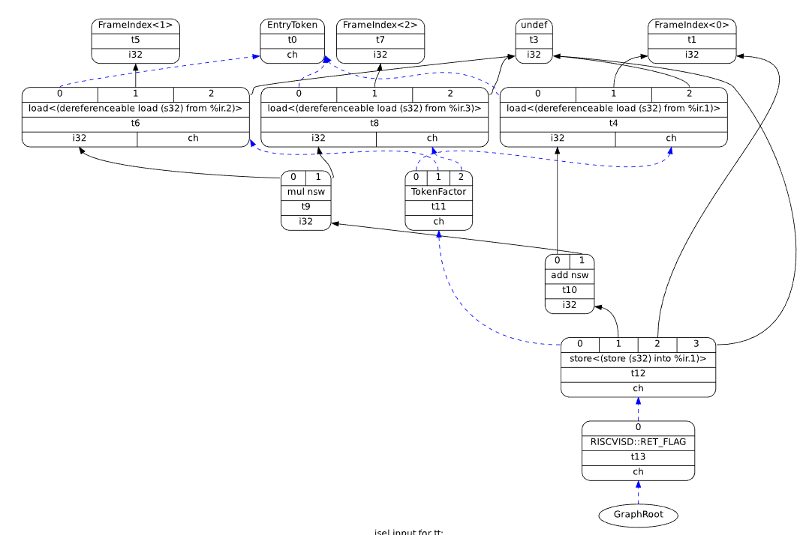

# llvm-riscv-extension-support

基于LLVM RISC-V后端实现新增扩展指令支持

以MADD为例，修改并编译LLVM RISC-V后端，使编译器可以识别C语言中的乘加部分，并生成最终的MADD机器码
```C
madd rd, rs1, rs2
```


- 能够通过自己编写的正确汇编测试程序，生成正确的madd指令编码
- 能够通过自己编写的错误汇编测试程序，进行适当的错误处理
- 能够通过自己编写的C语言测试程序，生成正确的madd汇编指令

LLVM添加指令有2种方式
- 改CPP
- .td中pattern或Pat（本仓库采用方法）

**更多结果**


## 指令格式


寄存器位置尽量保持不变
- 避免增加译码复杂度
- 避免增加关键路径长度
- 对提高主频、降低功耗有好处


## dag图
`llc –filetype=asm –view-isel-dags test.ll`
无madd时


有madd时


所处阶段

## 使用
直接复制llvm到llvm project，文件已按层次结构放置。

自定义feature为madd，想生成madd的汇编和机器码请加参数 `-mattr=madd`

### 增加文件
llvm/lib/Target/RISCV/RISCVInstrFormatsMy.td
llvm/lib/Target/RISCV/RISCVInstrInfoMadd.td
### 修改文件

llvm/lib/Target/RISCV/RISCV.td
llvm/lib/Target/RISCV/RISCVInstrInfo.td
llvm/test/MC/RISCV/my-valid.s
llvm/test/MC/RISCV/my-invalid.s


## 踩坑
- 编译相关：把ld换为gold，用ninja build，增大swap

- ins operand same name error

- .ll只用片段

- 测试汇编中无效指令测试样例的写法

- Feature默认值与设置值

- Pattern result和指令ins的操作数顺序

